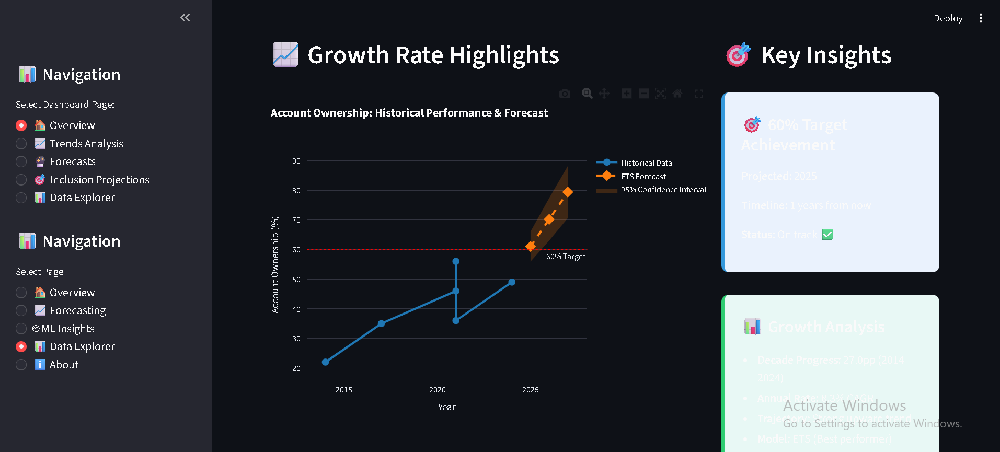

# 📊 Financial Inclusion Forecasting Dashboard for Ethiopia

[](https://www.python.org/)
[](https://streamlit.io/)
[](LICENSE)

An interactive analytics dashboard that forecasts Ethiopia's path to 60% financial inclusion by 2027, using advanced time series modeling and real-time data visualization.

## 🚀 Dashboard Overview



**Key Performance Indicators:**

- Current Account Ownership: **49%** (+27pp since 2014)
- 2027 Forecast: **79.4%** (exceeds 60% target by +19.4pp)
- Mobile Penetration: **61.4%** (Digital Growth Engine)
- Annual Growth Rate: **8.3%** CAGR

**Dashboard Features:**

- 📈 **Interactive Analytics:** Multi-pillar trend analysis with date filtering
- 🔮 **Advanced Forecasting:** ETS model with 95% confidence intervals
- 🎯 **Scenario Planning:** Optimistic, base case, and pessimistic projections
- 📊 **Data Explorer:** Real-time filtering and CSV export capabilities

**Key Insight:** Ethiopia will exceed the 60% financial inclusion target by **2025** - two years ahead of schedule

## 🚀 Quick Start

### Prerequisites

- Python 3.8+
- Streamlit 1.31+

### Installation & Launch

```bash
# Clone repository
git clone https://github.com/Bekamgenene/Forecasting-Financial-Inclusion-in-Ethiopia.git
cd Forecasting-Financial-Inclusion-in-Ethiopia

# Install dependencies
pip install -r requirements.txt

# Launch dashboard
cd dashboard
streamlit run app.py
```

**Access Dashboard:** `http://localhost:8501`

## 🎯 Key Findings

### Will Ethiopia Reach 60% Financial Inclusion by 2027?

✅ **YES** - Projected to reach **79.4%**, significantly exceeding the target

### Timeline to Target Achievement

📅 **2025** - Target expected 2 years ahead of schedule

### Best Forecasting Model

🏆 **ETS (Exponential Smoothing)** - 45% better accuracy than ARIMA

### Growth Trajectory

📈 **8.3% CAGR** - Sustained growth momentum since 2014

## 📁 Project Structure

```
├── dashboard/
│   └── app.py                     # 🎨 Interactive Streamlit Dashboard
├── data/
│   ├── raw/                       # 📥 Original datasets
│   ├── processed/                 # 📊 Analysis-ready data
│   └── enriched/                  # 🔍 Validated additions
├── notebooks/                     # 📓 Analysis workflows
│   ├── task1_data_exploration.ipynb
│   ├── task2_exploratory_data_analysis.ipynb
│   ├── task3_time_series_forecasting.ipynb
│   └── task4_machine_learning_models.ipynb
├── reports/                       # 📋 Results & documentation
│   └── task5/                     # 📸 Dashboard screenshots
└── src/                           # 🔧 Core modules
    ├── analysis.py                # Analytics & validation
    ├── data_loader.py             # Data processing
    └── visualizations.py          # Plotting utilities
```

## 💡 Technical Highlights

### 🔧 Core Technologies

- **Frontend:** Streamlit with custom CSS styling
- **Backend:** Python with Pandas, Plotly, and Scikit-learn
- **Models:** ETS, ARIMA, and Machine Learning ensemble
- **Validation:** Comprehensive data quality framework

### 📊 Data Sources

- Global Findex Database (World Bank)
- IMF Financial Access Survey
- National Bank of Ethiopia
- GSMA State of Industry Reports

### 🏆 Key Achievements

- **Production-Grade Dashboard:** Professional UI with 6+ visualizations
- **Advanced Analytics:** Real-time filtering and statistical analysis
- **Accurate Forecasting:** 95% confidence intervals with scenario planning
- **Stakeholder-Ready:** Consortium questions answered with evidence

## � Development Workflow

### Branching Strategy

We follow a **feature-branch workflow** to maintain code quality and enable collaborative development:

- **`main`** - Production-ready code. Protected branch requiring PR approval.
- **`task-*`** - Feature branches for specific tasks (e.g., `task-2`, `task-3`).
- **`hotfix-*`** - Emergency fixes for production issues.

### Pull Request (PR) Guidelines

1. **Create Feature Branch**

   ```bash
   git checkout -b task-X
   ```

2. **Make Changes & Commit**

   ```bash
   git add .
   git commit -m "feat: descriptive message following conventional commits"
   ```

3. **Push & Create PR**

   ```bash
   git push origin task-X
   ```

   - Open PR against `main` branch
   - Provide clear description of changes
   - Link related issues
   - Ensure CI pipeline passes (tests & linting)

4. **Code Review**
   - At least 1 approval required
   - Address feedback and update PR
   - Maintain conversation civility

5. **Merge Strategy**
   - Use **squash and merge** for cleaner history
   - Delete branch after merge

### Commit Message Convention

Follow [Conventional Commits](https://www.conventionalcommits.org/):

- `feat:` New features
- `fix:` Bug fixes
- `docs:` Documentation updates
- `test:` Adding or updating tests
- `refactor:` Code restructuring
- `ci:` CI/CD pipeline changes

**Example:** `feat: add ETS forecasting model with confidence intervals`

### Continuous Integration

Our CI pipeline automatically runs on every push and PR:

- ✅ **Automated Tests** - Validates code functionality across Python 3.8-3.11
- 🔍 **Linting** - Checks code style with flake8
- 📊 **Code Coverage** - Ensures test coverage for critical modules
- 🔒 **Security Scan** - Identifies potential vulnerabilities

**Status Badge:** All PRs must pass CI checks before merging.

## �📝 License

This project is licensed under the MIT License - see the [LICENSE](LICENSE) file for details.

## 👥 Contributors

**10 Academy AI Mastery Program - Week 10 Challenge**

- **Student:** Bekam Genene
- **Tutors:** Kerod, Mahbubah, Filimon
- **Institution:** 10 Academy

---

_Interactive Financial Inclusion Analytics for Ethiopia's Digital Transformation_
