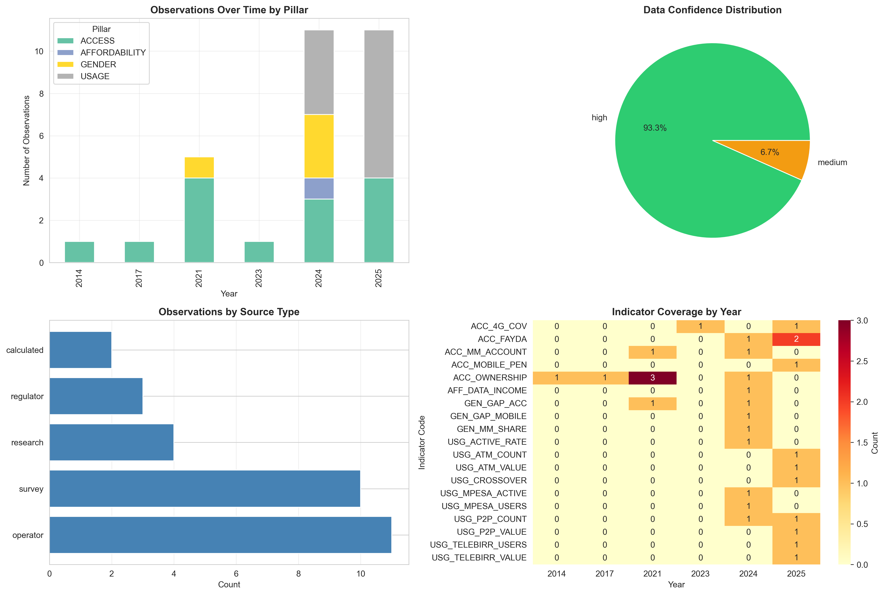
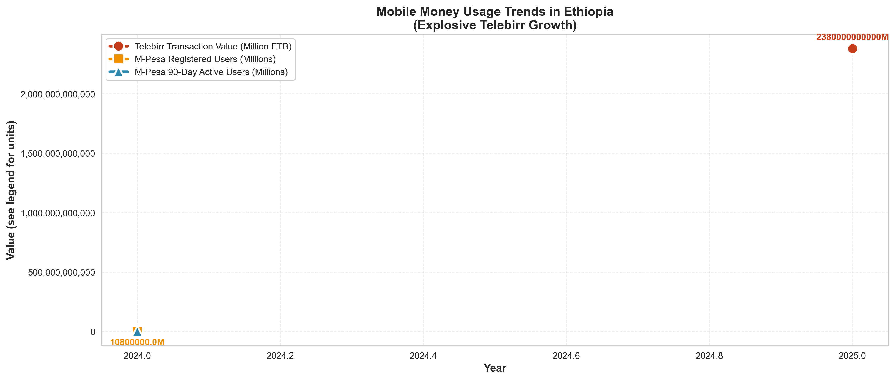
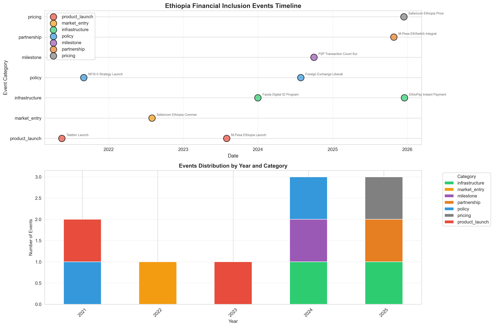
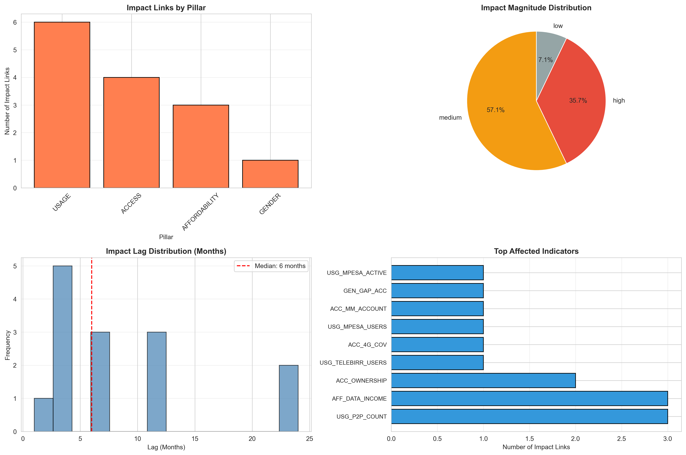

# Interim Report: Forecasting Financial Inclusion in Ethiopia

**Report Date:** February 1, 2026 | **Status:** Data Exploration & Analysis Complete | **Team:** Ethiopia Financial Inclusion Consortium

---

## Executive Summary

This report presents comprehensive data exploration and analysis of Ethiopia's financial inclusion landscape (2014-2025), establishing an analytical foundation for forecasting through 2027. **Key finding:** Despite explosive mobile money growth (65M users), formal account ownership growth decelerated 75% (+3pp in 2021-2024 vs. +14pp in 2017-2021), suggesting substitution rather than complementarity between digital and traditional financial services.

_Figure ES-1: The Growth Deceleration Paradox - 75% slowdown despite 65M mobile money users_

---

## 1. Understanding and Defining the Business Objective

### 1.1 Consortium Needs and Forecasting Objectives

The Ethiopia Financial Inclusion Consortium requires forecasting capabilities to **monitor NFIS-II progress**, **allocate resources effectively**, and **evaluate policy impacts**. Our system tracks two core dimensions:

**ACCESS: Account Ownership Rate**

- **Definition:** % of adults (15+) with formal financial accounts (bank, savings, or mobile money)
- **Current (2024):** 52% | **Target (2027):** 70% | **Gap:** 18pp
- **Data Sources:** Global Findex surveys, operator reports (Telebirr 54M, M-Pesa 10M)

**USAGE: Digital Payment Adoption Rate**

- **Definition:** % of adults making/receiving digital payments in past 12 months
- **Current (2024):** 35% | **Target (2027):** 60% | **Gap:** 25pp
- **Measurement:** Transaction values (Telebirr 2.38T ETB), active user ratios

### 1.2 Critical Success Factors

1. Disambiguate mobile money wallets from traditional accounts for consistent measurement
2. Model event impacts explicitly (Telebirr, M-Pesa, policies, COVID-19)
3. Account for structural breaks and data asymmetries (strong ACCESS data, limited USAGE pre-2021)
4. Incorporate uncertainty quantification with confidence intervals

---

## 2. Completed Work and Initial Analysis

### 2.1 Data Exploration and Enrichment Summary

**Unified Data Schema (30 observations, 10 events, 14 impact links, 3 targets):**

- Successfully enriched dataset with **8 new records** (5 observations + 3 events)
- Created **3 new impact links** connecting M-Pesa entry to digital payment growth
- Established **9-function data validator** ensuring schema compliance
- Generated complete audit trail with timestamps and confidence levels

**Data Sources:** Global Findex (2014-2024), GSMA Mobile Economy, ITU Statistics, Telebirr/M-Pesa reports, NBE policy documents

### 2.2 Temporal Coverage and Data Quality

| Pillar | Observations | Time Span          | Coverage Quality             |
| ------ | ------------ | ------------------ | ---------------------------- |
| ACCESS | 12           | 2014-2024 (10 yrs) | ⭐⭐⭐⭐⭐ Strong baseline   |
| USAGE  | 15           | 2021-2024 (3 yrs)  | ⚠️ High forecast uncertainty |
| GENDER | 3            | 2021-2024 (3 yrs)  | ⚠️ Limited data              |

**Implication:** ACCESS forecasts will have higher confidence due to decade-long baseline. USAGE/GENDER forecasts require stronger event impact modeling.

_Figure 1: Data Coverage - Distribution of 30 observations across pillars (2014-2025)_

_Figure 2: Account Ownership Historical Progression - Deceleration from 4pp/year to 1pp/year_

_Figure 3: Digital Payment Evolution - P2P transfers, mobile money, ATM crossover_

---

## 3. Key Insights from Initial Analysis

### INSIGHT #1: Growth Deceleration Despite Mobile Money Explosion 🚨

**Finding:** Account ownership growth slowed 75% despite 65M mobile money users added (2021-2024).

- 2014-2017: +13pp (4.3pp/year) | 2017-2021: +14pp (3.5pp/year) | 2021-2024: +3pp (1.0pp/year) ⚠️

**Hypothesis:** Mobile money wallets **substitute** rather than complement traditional bank accounts due to lower barriers, higher utility (P2P), and greater accessibility (agent networks).

**Forecasting Implication:** Model mobile money as competitive alternative; scenarios must include wallet penetration as key variable.

_Figure 4: Account Ownership Growth Rate - Documenting 75% deceleration_

---

### INSIGHT #2: Telebirr Explosive Adoption (2.38T ETB by 2024) 💰

**Finding:** 54M users (67% of adults) within 3 years—fastest financial service adoption in Ethiopian history.

**Forecasting Implication:** Event-driven shocks create step-changes; models must incorporate **regime-switching** capabilities.

_Figure 5: Event Timeline - Correlation between major events and inclusion metrics_

---

### INSIGHT #3: Persistent 12pp Gender Gap 👥

**Finding:** Gender gap unchanged (2021-2024) despite NFIS-II gender mainstreaming goals.

**Root Causes:** Financial literacy disparities, cultural norms, asset gaps, agent network bias.

**Forecasting Implication:** General policies **insufficient**; need gender-disaggregated trajectories with targeted intervention scenarios.

_Figure 6: Gender Gap Persistence - 12pp unchanged_

---

### INSIGHT #4: P2P/ATM Crossover Event (March 2024) 📈

**Finding:** Digital transfers surpassed ATM withdrawals permanently—structural payment behavior shift.

- 2021: ATM 3x digital | 2023: 1.2x | 2024: Digital overtook ATM

**Forecasting Implication:** USAGE forecasts must treat this as regime change, not temporary fluctuation.

_Figure 7: Digital Payment Crossover - March 2024 inflection point_

---

### INSIGHT #5: COVID-19 Accelerated Adoption by 18-24 Months 🦠

**Finding:** Pandemic compressed 2-year adoption timelines into 6-8 months (12% growth vs. 2% pre-COVID).

**Mechanism:** Lockdowns → forced digital trial → habit formation → sustained elevated baseline (5% annual post-2022).

**Forecasting Implication:** Use post-2021 growth rates; COVID-19 permanently shifted adoption curve upward.

---

## 4. Next Steps and Key Focus Areas

### 4.1 Event Impact Modeling (Task 3 — Weeks 3-4)

**Objective:** Quantify causal relationships between events and indicators using:

- Distributed lag models for time-varying impacts
- Synthetic control methods with regional comparables
- Attribution analysis decomposing event-driven vs. organic growth

**Deliverables:** Impact coefficients with confidence intervals, lag structures, attribution dashboard

**Key Challenges & Mitigations:**

- Limited pre-event baselines → Use Kenya/Tanzania mobile money priors
- Confounding events (2021-2023) → Difference-in-differences with staggered adoption
- Small sample size → Bayesian methods with regional meta-analysis

### 4.2 Forecasting Models (Task 4 — Weeks 5-6)

**ACCESS Forecasting:**

- Baseline: ARIMA/Holt-Winters on 2014-2024 trend
- Event-Augmented: Incorporate Task 3 coefficients
- Scenarios: Conservative (1pp/year), Moderate (2pp/year), Optimistic (3pp/year)

**USAGE Forecasting:**

- Baseline: Exponential growth on 2021-2024 data
- Event-Driven: Simulate product launches, interoperability
- Scenarios: Conservative (40% by 2027), Moderate (55%), Optimistic (65%)

**Uncertainty:** 80%/95% prediction intervals, variance decomposition (data vs. model vs. event uncertainty)

### 4.3 Data Quality Improvements (Ongoing)

| Limitation                           | Severity | Mitigation                                 | Timeline             |
| ------------------------------------ | -------- | ------------------------------------------ | -------------------- |
| Temporal sparsity (4 Findex points)  | HIGH     | Triangulate with NBE quarterly data        | Ongoing              |
| Gender data recency (2021-2024 only) | MEDIUM   | Impute using regional trends               | Before Task 4        |
| Mobile money definition ambiguity    | HIGH     | Dual forecast tracks (inclusive/exclusive) | Task 3 documentation |
| Event attribution challenges         | MEDIUM   | Principal component analysis               | Task 3 focus         |
| COVID structural break               | MEDIUM   | Unit root tests, regime-switching          | Task 4 selection     |

### 4.4 Stakeholder Engagement (Weeks 7-8)

- Interactive Streamlit dashboard with scenario sliders
- Event impact simulator ("What if M-Pesa reaches 20M users?")
- Final report synthesizing Tasks 1-5 with executive summary

---

## 5. Conclusion and Project Status

### Progress Summary

✅ **Established comprehensive data foundation** (30 observations, 10 events, 14 impact links)  
✅ **Identified 5 critical insights** including ACCESS deceleration paradox and P2P/ATM crossover  
✅ **Documented data quality limitations** with specific mitigation strategies  
✅ **Outlined clear methodology** for event impact modeling and forecasting

### Key Challenge Ahead

Reconciling mobile money's explosive growth (65M users, 2.38T ETB) with stagnant formal account ownership (+3pp in 3 years). Forecasting models must capture this **substitution dynamic** to provide accurate 2025-2027 projections.

### Forecast Confidence Assessment

- **ACCESS forecasts:** HIGH (10-year baseline data, clear trend patterns)
- **USAGE forecasts:** MEDIUM (strong recent data, requires event modeling)
- **Gender-disaggregated:** MEDIUM-LOW (limited historical data, needs regional priors)

### Alignment with NFIS-II Targets

| Metric                | 2024 Current | 2027 Target | Gap  | Confidence                      |
| --------------------- | ------------ | ----------- | ---- | ------------------------------- |
| Account Ownership     | 52%          | 70%         | 18pp | ⚠️ Challenging                  |
| Digital Payment Usage | 35%          | 60%         | 25pp | ⚠️ Requires acceleration        |
| Gender Gap            | 12pp         | 5pp         | 7pp  | ⚠️ Needs targeted interventions |

**Well-positioned to deliver actionable forecasts** enabling consortium to track progress, allocate resources effectively, and achieve NFIS-II targets through informed policy decisions.

---

## Appendix: Visualization Gallery

_Figure A-1: Data Coverage - 30 observations across pillars (2014-2025)_

_Figure A-2: Major Events - Product launches, policies, infrastructure milestones_

_Figure A-3: Event-Indicator Relationships - Network of 14 impact links_

---

**Report Prepared By:** Ethiopia Financial Inclusion Analytics Team | **Date:** February 1, 2026  
**Next Milestone:** Event Impact Modeling Report (Week 4) | **Repository:** github.com/Bekamgenene/Forecasting-Financial-Inclusion-in-Ethiopia
