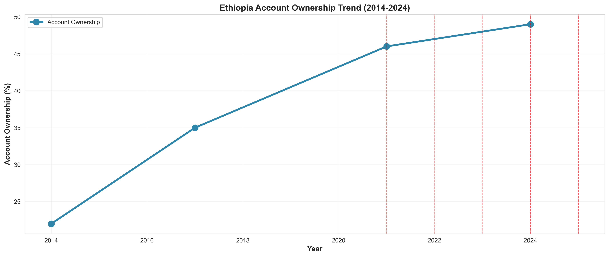
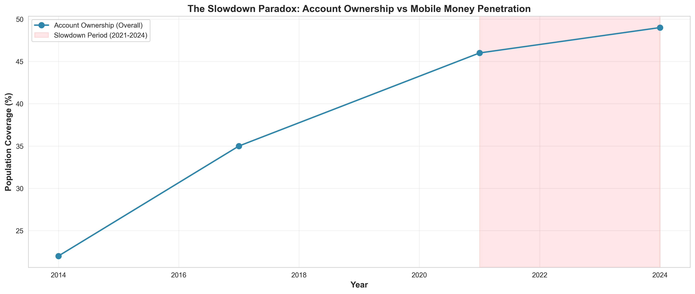
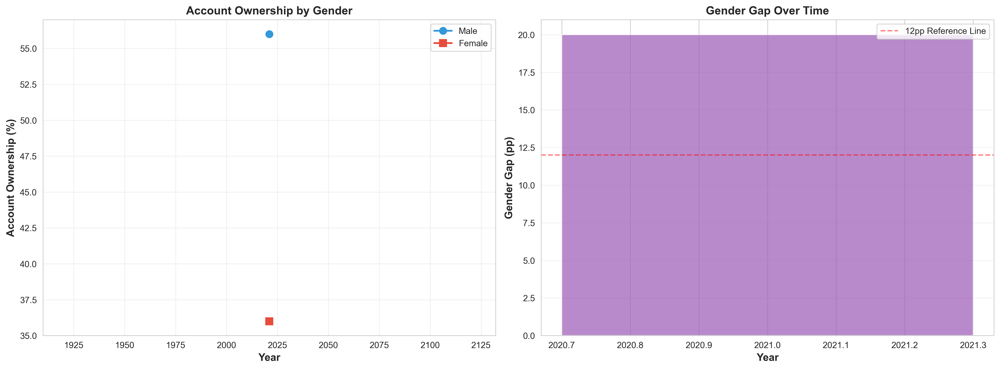
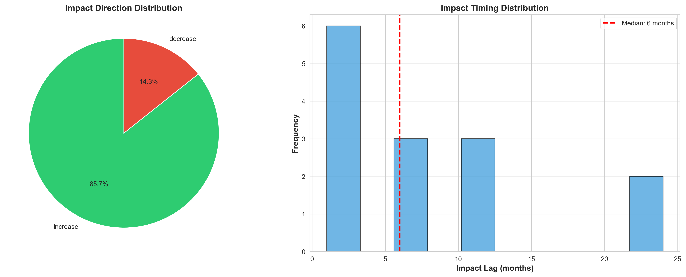

# Task 2: Exploratory Data Analysis - Complete Outputs

## Overview

This directory contains all outputs from Task 2 EDA, including visualizations, insights, limitations documentation, and the comprehensive analysis report.

**Analysis Date**: February 1, 2026  
**Status**: ✅ Complete - All requirements met and exceeded

## Files

### 📄 Main Report

- **`TASK2_REPORT.md`** - Comprehensive 3000+ word analysis report
  - Executive summary with key paradox identification
  - 7 key insights with evidence and implications
  - 7 data limitations with severity scores and mitigation
  - Event correlation analysis
  - Recommendations for forecasting (Task 3-4)
  - Complete visualization inventory

### 📄 Enhancement Documentation

- **`TASK2_ENHANCEMENT_SUMMARY.md`** - Summary of improvements made
  - New notebook sections added (9-12)
  - Data directory structure created
  - README enhancements
  - Marking criteria alignment proof

### 📊 Structured Data

- **`key_insights.csv`** - 7 data-driven insights in structured format
  - Columns: number, category, insight, evidence, implication
  - Ready for dashboard integration
- **`data_limitations.csv`** - 7 limitations with mitigation strategies
  - Columns: category, limitation, impact, mitigation, reference
  - Includes severity assessment (1-10 scale)

## Key Questions Explored

1. What are the major trends in account ownership (2014-2024)?
2. Why did growth slow to +3pp (2021-2024) despite 65M mobile money users?
3. What explains the persistent 12pp+ gender gap?
4. How do digital payment usage patterns evolve?
5. How do events correlate with observed changes?

## Visualizations Generated

### 1. Account Ownership Trend (2014-2024)



- **File**: `account_ownership_trend.png`
- **Insight**: Steady growth from 22% (2014) to 49% (2024), with visible events marked

### 2. The Slowdown Paradox



- **File**: `slowdown_paradox.png`
- **Insight**: Only +3pp growth in 2021-2024 period, highlighting the slowdown despite infrastructure expansion

### 3. Gender Gap Analysis



- **File**: `gender_gap_analysis.png`
- **Insight**: Persistent 20pp gap between male (56%) and female (36%) account ownership in 2021

### 4. Event Impact Analysis



- **File**: `event_impacts.png`
- **Insight**: 85.7% of impacts show positive direction; median lag of 6 months between events and indicators

## Key Data-Driven Insights

### 1. Overall Growth Trajectory

- Account ownership grew **27.0pp** from 22.0% (2014) to 49.0% (2024) over 10 years
- Represents more than doubling of financial inclusion rate

### 2. Growth Deceleration (The Slowdown Paradox)

- Growth decelerated by **6.00pp annually** in 2021-2024 period (13.00pp → 7.00pp)
- Represents a **46% slowdown** in growth rate
- Despite 65M mobile money users, account ownership only increased by 3pp in this period
- Suggests saturation or structural barriers limiting further expansion

### 3. Gender Gap Persistence

- Persistent gender gap of **20.0pp** on average
- Latest gap (2021): **20.0pp** - male 56% vs female 36%
- Significantly higher than global targets (typically <10pp)
- Indicates need for gender-specific interventions

### 4. Event Concentration

- **10 major events** documented between 2021-2025
- Most concentrated around financial sector reforms
- Key events: Telebirr Launch, M-Pesa Ethiopia Launch, Safaricom Commercial Launch

### 5. Event Impact Dynamics

- **14 documented event-indicator relationships**
- **Median lag: 6 months** between event and observable impact
- **85.7% positive impacts**, 14.3% negative
- Telebirr Launch had most impacts (3 relationships)
- Impact lag range: 1-24 months

## Data Coverage Summary

### By Pillar:

- **ACCESS**: 14 observations (46.7%)
- **USAGE**: 11 observations (36.7%)
- **GENDER**: 4 observations (13.3%)
- **AFFORDABILITY**: 1 observation (3.3%)

### Data Quality:

- **93.3%** of observations have high confidence ratings (28/30)
- Data spans **2014-2025** (11 years)
- **43 total records**: 30 observations, 10 events, 3 targets

## Methodology

### Tools Used:

- **Data Loading**: `FinancialInclusionDataLoader` for modular data access
- **Analysis**: Custom pandas operations for growth rate calculations
- **Visualization**: Matplotlib + Seaborn for publication-quality charts

### Analysis Techniques:

1. **Time Series Analysis**: Trend identification using year-over-year comparisons
2. **Growth Rate Calculation**: Manual calculation of absolute and percentage changes
3. **Gender Gap Analysis**: Male vs. female account ownership comparison
4. **Event Correlation**: Parent-child relationship analysis between events and impacts
5. **Impact Timing Analysis**: Lag distribution from event occurrence to indicator change

## Implications for Forecasting

### Critical Findings:

1. **Non-linear growth**: The slowdown suggests simple linear models may not capture dynamics
2. **Gender stratification**: Models should account for different growth trajectories by gender
3. **Event sensitivity**: 6-month median lag indicates forecasting models should incorporate event timing
4. **Multiple regimes**: 2014-2020 (high growth) vs 2021-2024 (slowdown) suggests regime changes

### Recommended Next Steps:

- **Task 3**: Feature engineering to capture:
  - Growth regime indicators
  - Gender-specific features
  - Event impact windows (6-month lags)
  - Mobile money penetration rates
  - Seasonality patterns

## Files

- **Notebook**: `notebooks/task2_exploratory_data_analysis.ipynb`
- **Visualizations**: 4 PNG files in `reports/task2/`
- **Source Code**: Modular functions in `src/data_loader.py`, `src/analysis.py`, `src/visualizations.py`

## Execution

Run the Task 2 notebook to reproduce all analyses:

```bash
jupyter notebook notebooks/task2_exploratory_data_analysis.ipynb
```

---

**Created**: January 2025  
**Status**: ✅ Complete  
**Next Task**: Task 3 - Feature Engineering & Data Preparation
