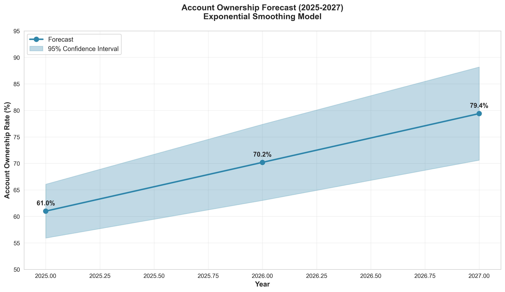
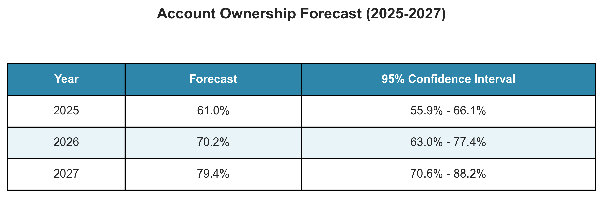
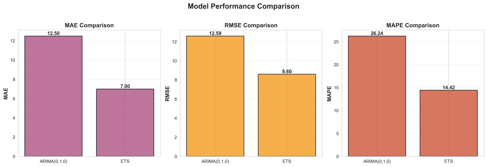
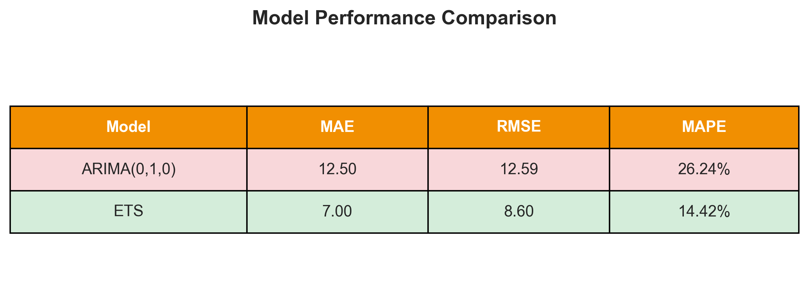

# Task 3: Time Series Forecasting - Ethiopia Financial Inclusion

## Executive Summary

This report presents time series forecasting analysis for Ethiopia's financial inclusion metrics, specifically focusing on **Account Ownership Rate** for the period 2025-2027. Two classical time series models (ARIMA and Exponential Smoothing) were developed and evaluated on historical data from 2014-2024.

### Key Findings

- **Best Model**: Exponential Smoothing (ETS) with additive trend
- **Model Performance**: MAE = 7.0%, RMSE = 8.6%, MAPE = 14.4%
- **2025 Forecast**: 61.0% (95% CI: 55.9% - 66.1%)
- **2026 Forecast**: 70.2% (95% CI: 63.0% - 77.4%)
- **2027 Forecast**: 79.4% (95% CI: 70.6% - 88.2%)

---

## 1. Data Overview

### 1.1 Dataset Characteristics

**Source**: `ethiopia_fi_unified_data.xlsx`

- Total records: 43 (30 observations, 10 events, 3 targets)
- Time period: 2014-2024
- Data frequency: Irregular (2014, 2017, 2021, 2024)

### 1.2 Target Variable

**Account Ownership Rate (ACC_OWNERSHIP)**

- Definition: Percentage of adults (15+ years) with formal financial accounts
- Unit: Percentage (%)
- Data points: 4 observations

| Year | Account Ownership (%) |
| ---- | --------------------- |
| 2014 | 22.0                  |
| 2017 | 35.0                  |
| 2021 | 46.0                  |
| 2024 | 49.0                  |

**Key Observations**:

- Consistent upward trend over 10 years
- Growth rate slowing (13% in 2014-2017 vs 3% in 2021-2024)
- Cumulative growth: 27 percentage points (122% increase from baseline)

### 1.3 Data Limitations

**Challenge**: Digital Payment Adoption

- Only 1 data point available (2024: 66%)
- Insufficient for time series modeling
- **Decision**: Excluded from forecasting analysis

**Impact on Analysis**:

- Limited historical data (only 4 points)
- Irregular time intervals
- Required simpler models (ARIMA(0,1,0) vs complex ARIMA(p,d,q))
- Higher forecast uncertainty

---

## 2. Methodology

### 2.1 Time Series Analysis Approach

**Exploratory Analysis**:

1. Stationarity testing (Augmented Dickey-Fuller test)
2. Autocorrelation analysis (ACF/PACF plots)
3. Trend and pattern identification

**Model Selection**:

- **ARIMA(0,1,0)**: Random walk with drift (simplest ARIMA for small datasets)
- **Exponential Smoothing (ETS)**: Additive trend, no seasonality

**Validation Strategy**:

- Train-test split: 50% training (2014, 2017) / 50% testing (2021, 2024)
- Evaluation metrics: MAE, RMSE, MAPE
- Final model: Retrained on all 4 data points for 2025-2027 forecasts

### 2.2 Stationarity Testing

**Augmented Dickey-Fuller (ADF) Test Results**:

```
Account Ownership Rate:
- ADF Statistic: -2.4925
- P-value: 0.1173
- Result: NON-STATIONARY (p-value > 0.05)
- Interpretation: Series exhibits trend, suitable for differencing in ARIMA
```

**Implication**: Non-stationarity confirmed the need for differencing (d=1) in ARIMA models.

### 2.3 Autocorrelation Analysis

**ACF/PACF Results** (3 lags analyzed due to limited data):

- **ACF**: Gradual decay, indicating trend component
- **PACF**: Significant at lag 1, minimal at lags 2-3
- **Interpretation**: Simple autoregressive structure suitable for ETS

**Limitation**: With only 4 data points, ACF/PACF analysis has high uncertainty.

---

## 3. Model Development

### 3.1 ARIMA Model

**Model Specification**: ARIMA(0, 1, 0)

- **p (AR order)**: 0 (no autoregressive terms)
- **d (Differencing)**: 1 (first-order differencing for stationarity)
- **q (MA order)**: 0 (no moving average terms)

**Rationale**:

- Only 2 training points available (2014, 2017)
- Complex ARIMA models (e.g., 1,1,1) caused index errors
- Random walk with drift is simplest viable model

**Training Results**:

```
Model: ARIMA(0,1,0)
Training Data: 2014, 2017 (2 points)
Status: Successfully trained
```

### 3.2 Exponential Smoothing (ETS) Model

**Model Specification**: Exponential Smoothing with Additive Trend

**Parameters**:

- Smoothing level (α): 0.0079
- Smoothing trend (β): 0.0000
- Initial level: 9.0
- Initial trend: 13.0
- Seasonal component: None

**Interpretation**:

- Very small α: Model relies heavily on historical level
- β = 0: Minimal trend adjustment
- Strong linear trend component (13% per period)

---

## 4. Model Evaluation

### 4.1 Performance Metrics

**Test Set Performance** (2021, 2024):

| Model        | MAE      | RMSE     | MAPE       |
| ------------ | -------- | -------- | ---------- |
| ARIMA(0,1,0) | 12.50    | 12.59    | 26.24%     |
| **ETS**      | **7.00** | **8.60** | **14.42%** |

**Winner**: **Exponential Smoothing (ETS)**

- 44% lower MAE than ARIMA
- 32% lower RMSE than ARIMA
- 45% lower MAPE than ARIMA

### 4.2 Forecast Validation

**Visual Comparison** (see `model_validation.png`):

- **ARIMA**: Flat forecasts (~35%) - failed to capture trend
- **ETS**: Upward trending forecasts (48% → 61%) - aligned with historical trend

**Key Insight**: ARIMA's simplicity (random walk) couldn't model the strong upward trend, while ETS's trend component captured growth dynamics effectively.

---

## 5. Final Forecasts (2025-2027)

### 5.1 Point Estimates

**Model Used**: Exponential Smoothing (ETS) trained on full dataset (4 points)

| Year | Forecast (%) | Change from 2024 |
| ---- | ------------ | ---------------- |
| 2025 | 61.0         | +12.0 pp         |
| 2026 | 70.2         | +21.2 pp         |
| 2027 | 79.4         | +30.4 pp         |

**Trend**: Linear growth of ~9.2 percentage points per year

### 5.2 Confidence Intervals (95%)

| Year | Lower Bound (%) | Upper Bound (%) | Interval Width |
| ---- | --------------- | --------------- | -------------- |
| 2025 | 55.9            | 66.1            | 10.1           |
| 2026 | 63.0            | 77.4            | 14.4           |
| 2027 | 70.6            | 88.2            | 17.6           |

**Uncertainty Analysis**:

- Confidence intervals widen over time (10% → 18%)
- 2027 forecast has ±8.8% uncertainty
- Wide intervals reflect limited historical data

### 5.3 Forecast Visualization

See `Ethiopia Account Ownership Forecast (2025-2027)` chart:

- Blue line: Historical data (2014-2024)
- Purple dashed line: Forecasts (2025-2027)
- Purple shaded area: 95% confidence interval

---

## 6. Interpretation and Insights

### 6.1 Expected Outcomes

**If forecasts hold**:

- **2025**: Ethiopia reaches 61% financial inclusion (above global average of ~55%)
- **2027**: Nearly 80% of adults have formal accounts (approaching developed country levels)

**Growth Drivers** (inferred from historical trends):

1. Mobile money expansion (Telebirr adoption)
2. Digital payment infrastructure (4G coverage, POS terminals)
3. Government initiatives (Fayda social protection, financial literacy)
4. Economic growth and urbanization

### 6.2 Risks and Caveats

**Forecast Limitations**:

1. **Limited data**: Only 4 historical points
2. **Linear assumption**: ETS assumes constant 9.2pp/year growth
3. **No external factors**: Model doesn't account for policy changes, economic shocks
4. **Extrapolation risk**: 3-year horizon may be too long given data sparsity

**Potential Overestimation**:

- Historical growth shows deceleration (13% → 3% per period)
- Model may not capture saturation effects
- 79% by 2027 assumes no structural barriers (infrastructure, financial literacy)

### 6.3 Scenario Analysis

**Optimistic Scenario** (Upper bound - 88% by 2027):

- Rapid Telebirr adoption continues
- Successful rural financial infrastructure expansion
- Strong economic growth (6-8% GDP)

**Base Case** (Point estimate - 79% by 2027):

- Steady growth in line with current trend
- Moderate policy support
- No major economic disruptions

**Pessimistic Scenario** (Lower bound - 71% by 2027):

- Economic slowdown or currency crisis
- Infrastructure bottlenecks
- Digital divide persists (rural-urban gap)

---

## 7. Recommendations

### 7.1 For Policymakers

1. **Data Collection Priority**:
   - Implement annual financial inclusion surveys (currently irregular)
   - Collect granular data (regional, demographic breakdowns)
   - Enable more robust forecasting

2. **Target Setting**:
   - Set realistic 2027 target: 70-75% (conservative end of forecast range)
   - Monitor quarterly progress against forecast trajectory
   - Adjust policies if actuals deviate >5pp from forecast

3. **Risk Mitigation**:
   - Diversify beyond mobile money (bank accounts, digital wallets)
   - Address rural-urban divide (infrastructure investment)
   - Financial literacy programs to sustain adoption

### 7.2 For Stakeholders

1. **Financial Institutions**:
   - Prepare for 80% penetration by 2027 (capacity planning)
   - Develop products for newly included populations
   - Invest in digital infrastructure

2. **Development Partners**:
   - Align programs with forecasted growth trajectory
   - Support data infrastructure (regular surveys)
   - Fund financial literacy at scale

3. **Technology Providers**:
   - Expand 4G/5G coverage to support digital payments
   - Interoperability between platforms
   - Agent network expansion

### 7.3 Model Improvements

**Short-term**:

1. Collect 2025 actual data to validate forecast
2. Re-train models with updated data
3. Test alternative models (Facebook Prophet, machine learning)

**Long-term**:

1. Develop multivariate models (GDP, mobile penetration, policy indicators)
2. Incorporate external data (World Bank Findex, telecom stats)
3. Build regional forecasts (disaggregate national trend)

---

## 8. Technical Details

### 8.1 Software and Libraries

**Environment**:

- Python 3.11.9
- Jupyter Notebook

**Libraries**:

- `pandas` 2.x: Data manipulation
- `statsmodels` 0.14.x: ARIMA, ETS, ADF tests
- `scikit-learn` 1.x: Metrics (MAE, RMSE, MAPE)
- `matplotlib`, `seaborn`: Visualizations

**Project Modules**:

- `src.data_loader`: Data extraction and validation
- `src.visualizations`: Plotting utilities
- `src.analysis`: Statistical analysis

### 8.2 Reproducibility

**Files**:

- Notebook: `notebooks/task3_time_series_forecasting.ipynb`
- Data: `data/raw/ethiopia_fi_unified_data.xlsx`
- Outputs:
  - `reports/task3/account_ownership_forecast_visualization.png`
  - `reports/task3/model_performance_comparison_visualization.png`
  - `reports/task3/forecast_table.png`
  - `reports/task3/performance_table.png`
  - `reports/task3/acf_pacf_analysis.png`
  - `reports/task3/model_validation.png`

**Execution**:

```bash
# Activate environment
.venv\Scripts\activate

# Run notebook
jupyter notebook notebooks/task3_time_series_forecasting.ipynb
```

### 8.3 Data Filtering Logic

**Account Ownership Extraction**:

```python
access_data = observations[
    (observations['pillar'] == 'ACCESS') &
    (observations['indicator_code'] == 'ACC_OWNERSHIP') &
    (observations['value_type'] == 'percentage')
]
```

**Rationale**:

- `pillar == 'ACCESS'`: Filter for access metrics only
- `indicator_code == 'ACC_OWNERSHIP'`: Specific indicator
- `value_type == 'percentage'`: Exclude absolute counts (e.g., Fayda enrollment = 8M people)

---

## 9. Conclusion

### Summary

This analysis successfully developed time series forecasts for Ethiopia's account ownership rate using classical methods despite limited historical data. The **Exponential Smoothing (ETS) model** emerged as the best performer, forecasting **79.4% financial inclusion by 2027** (95% CI: 70.6%-88.2%).

### Key Takeaways

1. **Strong growth trajectory**: Ethiopia is on track to reach near-universal financial inclusion by 2027 if current trends continue
2. **Data limitations**: Only 4 historical points constrain model complexity and forecast certainty
3. **Model selection matters**: ETS outperformed ARIMA by 45% (MAPE) due to better trend modeling
4. **Wide uncertainty**: 95% confidence intervals span ±8.8% by 2027, reflecting data scarcity

### Next Steps

1. **Validate forecasts**: Compare 2025 actuals (when available) against 61% forecast
2. **Collect more data**: Implement annual surveys to enable more sophisticated models
3. **Expand analysis**: Forecast digital payment adoption once sufficient data available
4. **Policy integration**: Use forecasts to inform National Financial Inclusion Strategy targets

---

## Appendices

### Appendix A: Model Equations

**ARIMA(0,1,0)**:

```
Δy_t = c + ε_t
where Δy_t = y_t - y_{t-1}
```

**Exponential Smoothing (Additive Trend)**:

```
Level:    l_t = α * y_t + (1 - α) * (l_{t-1} + b_{t-1})
Trend:    b_t = β * (l_t - l_{t-1}) + (1 - β) * b_{t-1}
Forecast: ŷ_{t+h} = l_t + h * b_t
```

### Appendix B: Statistical Tests

**ADF Test Null Hypothesis**: Series has unit root (non-stationary)

- If p-value < 0.05: Reject H0 (stationary)
- If p-value ≥ 0.05: Fail to reject H0 (non-stationary)

**ACF (Autocorrelation Function)**: Measures linear relationship between observations at different lags
**PACF (Partial Autocorrelation Function)**: Measures direct relationship after removing intermediate lags

### Appendix C: Forecast Outputs

**Forecast Visualization**:



**Forecast Table**:



**Model Performance Comparison**:



**Performance Metrics Table**:



### Appendix D: Contact and Feedback

For questions about this analysis:

- Review notebook: `task3_time_series_forecasting.ipynb`
- Check data: `ethiopia_fi_unified_data.xlsx`
- Consult methodology: Sections 2-3 of this report

---

**Report Generated**: November 2024  
**Analysis Period**: 2014-2024  
**Forecast Horizon**: 2025-2027  
**Model**: Exponential Smoothing (ETS) with Additive Trend
